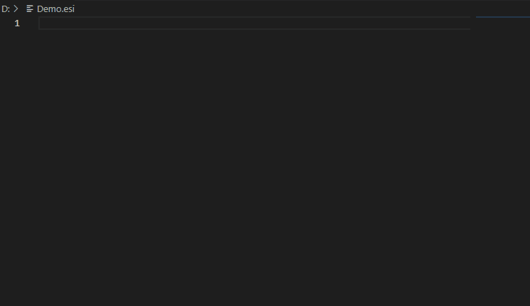
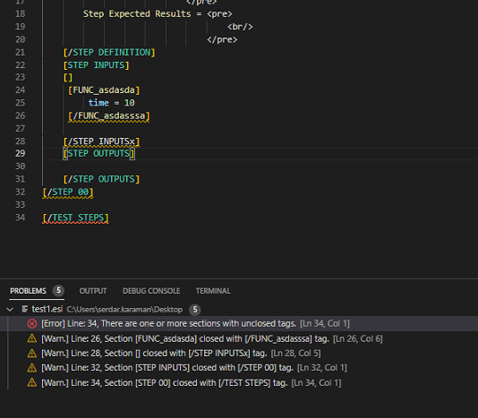

<h1 align="center">esi Helper for TestPit</h1>

<p align="center">
  <em>Syntax highlighting, validation, IntelliSense, and refactoring for TestPit <code>.esi</code> test scripts.</em>
</p>

<p align="center">
  <a href="https://marketplace.visualstudio.com/items?itemName=karamandev.esi-helper-for-testpit"></a>
  <a href="https://marketplace.visualstudio.com/items?itemName=karamandev.esi-helper-for-testpit"></a>
  <a href="https://marketplace.visualstudio.com/items?itemName=karamandev.esi-helper-for-testpit"></a>
  <a href="https://marketplace.visualstudio.com/items?itemName=karamandev.esi-helper-for-testpit&ssr=false#review-details"></a>
  <a href="https://github.com/Mavrikant/esi-Helper-for-TestPit/actions/workflows/ci.yaml"></a>
  <a href="https://github.com/Mavrikant/esi-Helper-for-TestPit/releases"></a>
  <a href="https://github.com/Mavrikant/esi-Helper-for-TestPit/blob/main/LICENSE"></a>
  <a href="https://github.com/Mavrikant/esi-Helper-for-TestPit"></a>
</p>

---

**esi Helper for TestPit** turns VS Code into a first-class editor for TestPit test scripts. It validates scripts as you type, highlights unknown identifiers, autocompletes connections / fields / enums from your project's TestPit XML configs, and formats `.esi` files with bus-aware indentation — so you spend less time chasing typos and more time writing tests.

<p align="center">
  
</p>

<p align="center">
  
</p>

## Highlights

- **Live validity check** against the configured `TestPit.exe` — errors surface in the Problems panel while you type.
- **Component IntelliSense** for `429_…`, `1553_…`, `DIS_…`, `Mem_…`, `VORILS<N>_…`, `PART_<partition>_<port>`, and `ED_…` (External Data) tags. Connections, fields, enum values, and `%VARIABLE%` references are completed and hover-documented from the active profile's TestPit XML configs. Re-indexes automatically when the XMLs change.
- **CSV-cell validation:** `field = file.csv line:N col:M` reads the referenced cell and validates its value against the field's enum table.
- **Enum value validation** by name **or number** — `SDI = INSTALLATION_NUMBER_ONE` and `SDI = 1` are both accepted, while an out-of-table value is flagged (matching TestPit's resolver). Macros/CSV/file references are skipped.
- **Structural & conformance checks** (need no profile — they run even before you pick one): unbalanced/mismatched section tags; duplicate keys within a message block; A708 messages, `MANUAL_VERIFY`/`EXTERNAL_VERIFY`, or output-only fields (`occurrence`/`synchronize`) placed under `[STEP INPUTS]`; and numeric values outside a field's `MinValue`/`MaxValue`. These mirror TestPit's own validator and are deliberately skipped for `%macro%`/CSV/include-sourced values, so they never false-positive.
- **Rich syntax highlighting** — distinct, theme-overridable colours for section tags, message fields, keys, enum values, `%MACRO%` references, file/folder paths, quoted strings, numbers, constants and comments. Resolved component identifiers carry a `defaultLibrary` semantic modifier so unknown/stale ones stand out.
- **Auto-formatting** with ESI-aware indentation **and `=` alignment**: `[TAG]…[/TAG]` contents indent in 4-space steps; field assignments in a section align their `=` to one column (`esihelper.alignmentScope` = `section` or `tier`), including `<pre>` openers whose bodies stay under the aligned `<pre>`. Runs via **Format Document** (`Shift+Alt+F`) or on save (`esihelper.refactorDocumentOnSave`); tabs → 4 spaces on every save.
- **Quick-fix code actions** for unknown enum values — pick the right one from a lightbulb menu.
- **Multi-profile support driven by TestPit's own settings:** profiles and their config files are read from the Windows registry (`HKCU\Software\ESEN\TestPit`). The status-bar item (bottom-right) shows the active profile; click to switch via QuickPick.
- **Snippets** for `[STEP]`, `[STEP DEFINITION]`, `[STEP INPUTS]`, `[STEP OUTPUTS]`, `[VARIABLES]`, `[FUNC_*]`, `[PART_*]`, `[CMD_EXECUTE]`, `[MANUAL_VERIFY]`, `[EXTERNAL_VERIFY]`, `[STEP GET_DUMP]`.
- **Step renumbering** (sequential 10, 20, 30, …) and **Goto step** (`Ctrl+G`).
- **Open with TestPit** — launches the active script in the configured `TestPit.exe`.

## Getting started

1. Install the extension from the [VS Code Marketplace](https://marketplace.visualstudio.com/items?itemName=karamandev.esi-helper-for-testpit).
2. Open any `.esi` file. On first use you're prompted to **pick your `TestPit.exe`** (the console build, used for validation) — or run **ESI Helper: Pick TestPit Executable** any time.
3. The status bar (bottom-right) shows the active **TestPit profile**, read from TestPit's own registry settings. Click it to switch profiles, or run **ESI Helper: Reload TestPit Settings** after you change config paths in the TestPit GUI.

## How configuration works

The extension reads the profiles and their config-file paths straight from **TestPit's Windows registry settings** at `HKEY_CURRENT_USER\Software\ESEN\TestPit` — the same settings the TestPit GUI manages. There is nothing to wire up per project:

- `Settings\SettingPrefix` lists the profiles; element `[0]` is the active one.
- Each `<Profile>\Executer\*ConfigFile` value supplies a config path by **role** (`ConfigFile`→cable, `A429ConfigFile`, `1553ConfigFile`, `DiscreteConfigFile`, `PartitionConfigFile`, `VORILSConfigFile`, `EDConfigFile`); element `[0]` is the live file.

On first use this is exported once and cached in the extension's global storage; switching profiles reads the cache, and **Reload TestPit Settings** re-exports it. The `TestPit.exe` path is **not** in the registry, so it's picked once via a dialog and remembered.

### Settings

All `esihelper.*` settings are **user-scoped (machine-wide)** — they live in your VS Code _User_ settings, never in `.vscode/settings.json`.

| Setting | Purpose |
|---|---|
| `esihelper.refactorDocumentOnSave` | When `true`, runs the full ESI formatter (re-indent + `=` alignment) on save. (Tabs → 4 spaces happens on every save regardless.) |
| `esihelper.alignmentScope` | `section` (default) aligns `=` within each block; `tier` aligns all blocks at the same bracket-depth together. |

## Commands

| Command | What it does | Keybinding |
|---|---|---|
| ESI Helper: Run Validity Check | Validate the current `.esi` against the active profile (`TestPit.exe --validateScriptOnly`); results go to the output channel / Problems panel. | — |
| ESI Helper: Open with TestPit | Open the current script in the TestPit **GUI** (`TestPitw.exe`, derived from the configured executable's folder). | — |
| ESI Helper: Update Step Numbers | Renumber `[STEP N]` blocks sequentially (10, 20, 30, …). | — |
| ESI Helper: Refactor Document | Trim trailing whitespace and convert tabs to 4 spaces. | — |
| ESI Helper: Show Processed File | Open TestPit's last preprocessed script (`Documents\Testpit\Preprocessed.esi`) side‑by‑side. | — |
| ESI Helper: Select TestPit Profile | Switch the active profile (from the registry's `SettingPrefix`); also offers "Change TestPit executable…". | — |
| ESI Helper: Reload TestPit Settings | Re-read profiles & config-file paths from the registry — run this after adding a profile or changing config paths in the TestPit GUI. | — |
| ESI Helper: Pick TestPit Executable | Choose / re-point the console `TestPit.exe` used for validation. | — |
| ESI Helper: Show Component Validation Info | Diagnostic dump: active profile, resolved config files, index size, and the current component‑validation issues. | — |
| Goto step number | Jump to a `[STEP N]` by number. | `Ctrl+G` (when editing `.esi`) |
| Format Document (built-in) | ESI‑aware indentation **+ `=` alignment**. | `Shift+Alt+F` (when editing `.esi`) |

## Development

```bash
npm install
npm run compile     # tsc → out/
npm run lint        # ESLint (flat config)
npm test            # mocha unit tests
npm run coverage    # c8 coverage report
```

Press `F5` in VS Code to launch the Extension Development Host. CI runs lint + compile + test on Ubuntu / macOS / Windows × Node 22 for every push to `main` and every PR.

See [CLAUDE.md](CLAUDE.md) for an architecture overview and contribution conventions, and [CHANGELOG.md](CHANGELOG.md) for release history.

## Author

**M. Serdar Karaman** — [GitHub](https://github.com/Mavrikant) · [LinkedIn](https://www.linkedin.com/in/mserdarkaraman/) · [karaman.dev](https://karaman.dev/)

## License

Licensed under the [GNU General Public License v3.0](LICENSE).

Copyright © 2020 M. Serdar Karaman
